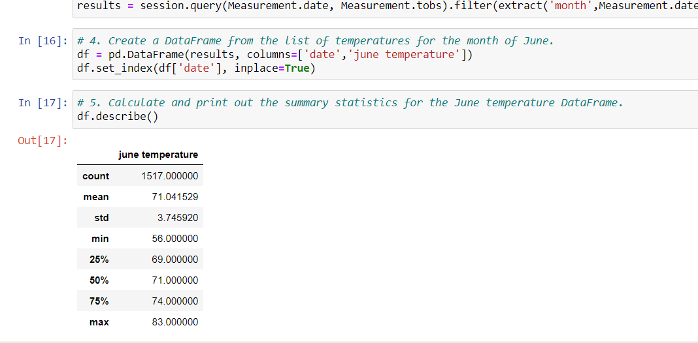
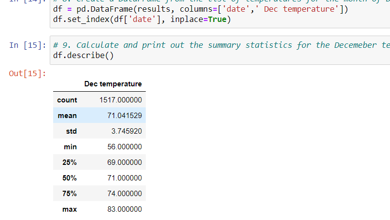

Purpose:

The purpose of this analysis was to help W.Avy to determine if the surf and ice cream shop business is sustainable all year round. 
We compare the temperature data for the months of June and December in Oahu.

Results:
# June Temperature

# December Temperature

. The average temperature in June is three degree higher than the December.
. The maximum temperature in June is two degree higher than the December.
. Overall there is only 3-4 degrees difference in weather in June and December.

Summary:
I think surf and ice cream shop is sustainable all year round. Looking at the data there is only few degrees differences in the temperature. 